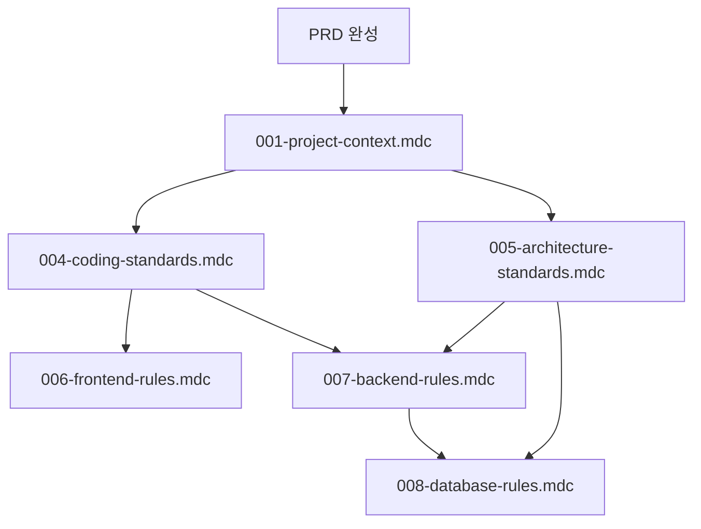

# 🎓 PRD 기반 룰 개발 교육 가이드

> 이 문서는 @Architect가 `/docs` 하위 문서들을 기반으로 PRD를 생성하고, 그 PRD를 바탕으로 체계적인 개발 룰을 생성하는 전체 프로세스를 안내합니다.

## 📋 목차

1. [현재 상황 분석](#1-현재-상황-분석)
2. [PRD 생성 프로세스](#2-prd-생성-프로세스)
3. [핵심 룰 생성 전략](#3-핵심-룰-생성-전략)
4. [단계별 룰 생성 가이드](#4-단계별-룰-생성-가이드)
5. [최종 룰 시스템 완성](#5-최종-룰-시스템-완성)

---

## 1. 현재 상황 분석

### 1.1 기존 자산 현황

#### ✅ 존재하는 자산
```
.cursor/rules/ (4개 협업 룰)
├── 002-orchestra-collaboration.mdc    # AI 협업 워크플로우
├── 003-agent-roles.mdc               # AI 에이전트 역할 정의  
├── 014-taskmaster-integration.mdc    # Task Master 통합 규칙
└── 016-context.mdc                   # 컨텍스트 관리

docs/ (풍부한 프로젝트 문서)
├── 01_초기사업기획서.md              # 비즈니스 모델 및 목표
├── 02_킥오프회의록_240201.md         # 프로젝트 스코프 및 팀 구성
├── 03_요구사항정의회의록_240208.md    # 상세 기능 요구사항
├── 04_기술스택선정회의록_240215.md    # 기술 아키텍처 결정
├── 05_사용자인터뷰결과회의록_240222.md # 사용자 니즈 분석
├── 06_시스템아키텍처정의서.md         # 기술 아키텍처 상세
├── 07_PRD생성프롬프트가이드.md        # PRD 작성 가이드
└── 08_요구사항정의서.md              # 요구사항 명세
```

#### ❌ 생성 필요한 자산
```
핵심 개발 룰 (6개) - 우선 생성 필요
├── 001-project-context.mdc           # 프로젝트 전체 컨텍스트
├── 004-coding-standards.mdc          # 공통 코딩 표준
├── 005-architecture-standards.mdc    # 시스템 아키텍처 표준
├── 006-frontend-rules.mdc            # React/TypeScript 프론트엔드
├── 007-backend-rules.mdc             # Java SpringBoot 백엔드
└── 008-database-rules.mdc            # PostgreSQL 데이터베이스

운영 및 품질 룰 (7개) - 후속 생성
├── 009-external-api-rules.mdc        # 외부 API 연동
├── 010-security-policies.mdc         # 보안 정책
├── 011-testing-standards.mdc         # 테스트 전략
├── 012-deployment-cicd.mdc           # 배포 및 CI/CD
├── 013-monitoring-logging.mdc        # 모니터링 및 로깅
├── 014-api-documentation.mdc         # API 문서화
└── 015-error-handling.mdc            # 에러 처리
```

### 1.2 프로젝트 도메인 특성

**자동차 정비 예약 시스템**의 핵심 특성:
- **B2C 플랫폼**: 고객 ↔ 정비소 중개 서비스
- **실시간 처리**: 예약, 진행상황, 결제 실시간 관리
- **신뢰성 중요**: 금융 거래, 개인정보, 차량정보 처리
- **모바일 최적화**: 고객의 80% 이상 모바일 사용 예상
- **복잡한 비즈니스 로직**: 예약 충돌 방지, 견적 시스템, 진행 단계 관리

---

## 2. PRD 생성 프로세스

### 2.1 PRD 생성 순서

#### Step 1: 완전한 PRD 문서 생성
```
@Architect new_task: 완전한 PRD (Product Requirements Document) 생성
- 참조: @docs/01_초기사업기획서.md @docs/02_킥오프회의록_240201.md @docs/03_요구사항정의회의록_240208.md @docs/04_기술스택선정회의록_240215.md @docs/05_사용자인터뷰결과회의록_240222.md @docs/06_시스템아키텍처정의서.md @docs/08_요구사항정의서.md
- 전제조건: 
  * 모든 회의록과 기획서의 내용을 종합하여 완전한 PRD 작성
  * 자동차 정비 예약 시스템 도메인 특화
  * 기능별 승인 조건 명확히 정의
  * P0/P1/P2 우선순위 분류
  * 비기능 요구사항 포함 (성능, 보안, 사용성)
- 기대결과: .taskmaster/docs/prd.txt 생성
  * 프로젝트 개요 및 비즈니스 목표
  * 상세 기능 요구사항 (10개 섹션 이상)
  * 기술스택 및 아키텍처 가이드
  * 승인 조건 및 테스트 전략
  * 개발 일정 및 마일스톤
```

### 2.2 PRD 품질 검증 기준

완성된 PRD는 다음 요소를 포함해야 합니다:

✅ **비즈니스 섹션**
- [ ] 프로젝트 목표 및 성공 지표
- [ ] 사용자 페르소나 및 시나리오
- [ ] 시장 분석 및 경쟁 우위

✅ **기능 섹션**
- [ ] 사용자 관리 (인증, 권한, 프로필)
- [ ] 차량 정보 관리 시스템
- [ ] 정비소 관리 시스템  
- [ ] 예약 시스템 (핵심 기능)
- [ ] 견적 및 가격 관리
- [ ] 결제 시스템
- [ ] 알림 및 커뮤니케이션
- [ ] 정비 프로세스 관리
- [ ] 리뷰 및 평점 시스템

✅ **기술 섹션**
- [ ] 기술스택 상세 (React, Java SpringBoot, PostgreSQL)
- [ ] 시스템 아키텍처 설계
- [ ] 외부 API 연동 (토스페이먼츠, 카카오맵, SMS)
- [ ] 보안 및 성능 요구사항

✅ **품질 섹션**
- [ ] 기능별 승인 조건
- [ ] 테스트 전략
- [ ] 개발 일정 및 마일스톤

---

## 3. 핵심 룰 생성 전략

### 3.1 룰 생성 우선순위



**Phase 1: 기초 룰 (의존성 없음)**
1. `001-project-context.mdc` - 프로젝트 전체 컨텍스트

**Phase 2: 공통 표준 룰 (project-context 의존)**
2. `004-coding-standards.mdc` - 공통 코딩 표준
3. `005-architecture-standards.mdc` - 시스템 아키텍처 표준

**Phase 3: 기술별 특화 룰 (공통 표준 의존)**
4. `006-frontend-rules.mdc` - React/TypeScript 프론트엔드
5. `007-backend-rules.mdc` - Java SpringBoot 백엔드  
6. `008-database-rules.mdc` - PostgreSQL 데이터베이스

### 3.2 각 룰의 핵심 목적

| 룰 파일 | 핵심 목적 | PRD 참조 섹션 |
|---------|-----------|---------------|
| 001-project-context.mdc | 프로젝트 비전, 목표, 기술스택 통합 가이드 | 1장(개요), 4장(기술스택) |
| 004-coding-standards.mdc | 언어별 공통 코딩 규칙, 명명법, 보안 | 4장(기술스택), 9장(품질보증) |
| 005-architecture-standards.mdc | 시스템 설계 원칙, API 설계, 데이터 모델 | 4장(기술스택), 5장(데이터모델) |
| 006-frontend-rules.mdc | React/TypeScript 특화 개발 가이드 | 기술스택, UI/UX 요구사항 |
| 007-backend-rules.mdc | Java SpringBoot 특화 개발 가이드 | 기술스택, API 설계, 비즈니스로직 |
| 008-database-rules.mdc | PostgreSQL 스키마, 쿼리 최적화 가이드 | 5장(데이터모델), 성능요구사항 |

---

## 4. 단계별 룰 생성 가이드

### 4.1 Phase 1: 프로젝트 컨텍스트 룰 생성

#### 🎯 001-project-context.mdc 생성 프롬프트
```
@Architect new_task: 프로젝트 전체 컨텍스트 룰 생성
- 참조: @.taskmaster/docs/prd.txt
- 전제조건: 
  * 자동차 정비 예약 시스템의 비전, 목표, 핵심 가치 정의
  * 기술스택 전체 개요 (React + Java SpringBoot + PostgreSQL)
  * 프로젝트 구조 및 개발 우선순위 (P0/P1/P2)
  * 성능 및 품질 요구사항 요약
  * 다른 룰들이 참조할 수 있는 기본 정보 제공
- 기대결과: .cursor/rules/001-project-context.mdc 생성
  * 프로젝트 개요 및 핵심 가치
  * 전체 기술스택 아키텍처
  * 도메인 비즈니스 로직 개요
  * 성능 및 품질 목표
  * 하위 룰 참조 구조 정의
```

**예상 생성 시간**: 15-20분
**의존성**: 없음
**검증 포인트**: 
- [ ] 자동차 정비 도메인 특화 내용 포함
- [ ] 기술스택 전체 그림 제시
- [ ] 하위 룰들의 참조 기준 제공

### 4.2 Phase 2: 공통 표준 룰 생성

#### 🎯 004-coding-standards.mdc 생성 프롬프트
```
@Architect new_task: 공통 코딩 표준 룰 생성
- 참조: @.taskmaster/docs/prd.txt @.cursor/rules/001-project-context.mdc
- 전제조건: 
  * 자동차 정비 도메인 특화 명명 규칙 (booking, vehicle, serviceCenter)
  * Java, TypeScript 공통 코딩 표준
  * 보안 가이드라인 (개인정보, 결제정보, 차량정보)
  * 성능 최적화 패턴
  * 에러 처리 및 로깅 표준
- 기대결과: .cursor/rules/004-coding-standards.mdc 생성
  * 전역 명명 규칙 (변수, 함수, 클래스, 테이블)
  * 도메인 특화 명명 표준
  * 보안 코딩 가이드라인
  * 성능 최적화 패턴
  * 에러 처리 표준
```

#### 🎯 005-architecture-standards.mdc 생성 프롬프트
```
@Architect new_task: 시스템 아키텍처 표준 룰 생성
- 참조: @.taskmaster/docs/prd.txt @.cursor/rules/001-project-context.mdc
- 전제조건:
  * 계층형 아키텍처 설계 (Presentation/Business/Data Layer)
  * REST API 설계 원칙 및 표준
  * 데이터베이스 설계 표준 (PostgreSQL)
  * 외부 API 연동 아키텍처 (토스페이먼츠, 카카오맵)
  * 보안 아키텍처 (JWT, 암호화, 접근제어)
  * 캐싱 전략 (Redis)
- 기대결과: .cursor/rules/005-architecture-standards.mdc 생성
  * 시스템 전체 아키텍처 구조
  * API 설계 표준 및 명명 규칙
  * 데이터베이스 설계 원칙
  * 보안 아키텍처 설계
  * 외부 연동 패턴
```

**예상 생성 시간**: 각 20-25분
**의존성**: 001-project-context.mdc
**검증 포인트**:
- [ ] 상위 룰(001) 내용과 일관성 유지
- [ ] 자동차 정비 도메인 용어 일관성
- [ ] 실무 적용 가능한 구체적 가이드

### 4.3 Phase 3: 기술별 특화 룰 생성

#### 🎯 006-frontend-rules.mdc 생성 프롬프트
```
@Architect new_task: React/TypeScript 프론트엔드 룰 생성
- 참조: @.taskmaster/docs/prd.txt @.cursor/rules/001-project-context.mdc @.cursor/rules/004-coding-standards.mdc
- 전제조건:
  * React.js + TypeScript + Tailwind CSS 스택
  * PWA 지원 (모바일 최적화)
  * 자동차 정비 도메인 컴포넌트 (BookingForm, VehicleCard, ProgressTracker)
  * 상태 관리 (React Query + Context API)
  * 외부 API 연동 (카카오맵, 토스페이먼츠)
  * 접근성 및 반응형 디자인
- 기대결과: .cursor/rules/006-frontend-rules.mdc 생성
  * 컴포넌트 설계 및 구조 표준
  * 도메인 특화 컴포넌트 예시
  * 상태 관리 패턴
  * 외부 API 연동 가이드
  * 성능 최적화 및 PWA 구현
```

#### 🎯 007-backend-rules.mdc 생성 프롬프트
```
@Architect new_task: Java SpringBoot 백엔드 룰 생성
- 참조: @.taskmaster/docs/prd.txt @.cursor/rules/001-project-context.mdc @.cursor/rules/004-coding-standards.mdc @.cursor/rules/005-architecture-standards.mdc
- 전제조건:
  * Java SpringBoot + MyBatis + JWT 인증
  * 자동차 정비 비즈니스 로직 (예약 충돌 방지, 견적 시스템)
  * REST API 구현 표준
  * 외부 API 연동 (토스페이먼츠, SMS API)
  * 트랜잭션 관리 및 예외 처리
  * 보안 구현 (Spring Security)
- 기대결과: .cursor/rules/007-backend-rules.mdc 생성
  * Controller/Service/Repository 구조
  * 비즈니스 로직 구현 패턴
  * MyBatis 매퍼 구현 표준
  * 외부 API 클라이언트 구현
  * 보안 및 예외 처리
```

#### 🎯 008-database-rules.mdc 생성 프롬프트
```
@Architect new_task: PostgreSQL 데이터베이스 룰 생성
- 참조: @.taskmaster/docs/prd.txt @.cursor/rules/005-architecture-standards.mdc @.cursor/rules/007-backend-rules.mdc
- 전제조건:
  * PostgreSQL 스키마 설계 표준
  * 자동차 정비 도메인 테이블 설계 (users, vehicles, bookings, service_centers)
  * MyBatis 매퍼 구현 가이드
  * 인덱싱 및 쿼리 최적화 전략
  * 데이터 백업 및 마이그레이션
  * JSON 데이터 활용 (service_items, progress 등)
- 기대결과: .cursor/rules/008-database-rules.mdc 생성
  * 테이블 설계 표준 및 명명 규칙
  * 도메인 특화 스키마 예시
  * MyBatis XML 매퍼 표준
  * 인덱싱 전략 및 성능 최적화
  * 데이터 관리 및 백업 정책
```

**예상 생성 시간**: 각 20-30분
**의존성**: 001, 004, 005 룰들
**검증 포인트**:
- [ ] 상위 룰들과의 일관성 및 참조 관계
- [ ] 자동차 정비 도메인 특화 예시 3개 이상
- [ ] 실행 가능한 코드 예시 포함

---

## 5. 최종 룰 시스템 완성

### 5.1 핵심 룰 완성 후 검증

6개 핵심 룰 생성 완료 후 다음 사항을 검증합니다:

✅ **구조적 완성도**
- [ ] MDC 메타데이터 완전 작성 (description, globs, alwaysApply)
- [ ] 표준 5섹션 구조 (원칙, 구현가이드, 예시, 예외처리, 참조)
- [ ] 상호 참조 관계 일관성

✅ **내용적 품질**
- [ ] 자동차 정비 도메인 특화 내용 (용어, 예시, 시나리오)
- [ ] 실무 적용 가능한 구체적 가이드
- [ ] PRD 요구사항과의 일치성

✅ **기술적 정확성**
- [ ] 코드 예시의 컴파일/실행 가능성
- [ ] 선택한 기술스택과의 일치성
- [ ] 성능 및 보안 요구사항 반영

### 5.2 추가 룰 생성 프로세스

핵심 6개 룰 완성 후, 운영 및 품질 관리를 위한 7개 추가 룰을 생성:

**우선순위별 생성 순서**:
1. **P0 (즉시 필요)**: 009-external-api-rules.mdc, 010-security-policies.mdc
2. **P1 (1개월 내)**: 011-testing-standards.mdc, 012-deployment-cicd.mdc  
3. **P2 (2개월 내)**: 013-monitoring-logging.mdc, 014-api-documentation.mdc, 015-error-handling.mdc

### 5.3 최종 룰 시스템 구조

완성된 룰 시스템:
```
.cursor/rules/
├── 001-project-context.mdc           # 프로젝트 전체 컨텍스트 ✅
├── 002-orchestra-collaboration.mdc   # AI 협업 워크플로우 (기존)
├── 003-agent-roles.mdc              # AI 에이전트 역할 (기존)
├── 004-coding-standards.mdc          # 공통 코딩 표준 ✅
├── 005-architecture-standards.mdc    # 시스템 아키텍처 표준 ✅
├── 006-frontend-rules.mdc            # React/TypeScript 프론트엔드 ✅
├── 007-backend-rules.mdc             # Java SpringBoot 백엔드 ✅
├── 008-database-rules.mdc            # PostgreSQL 데이터베이스 ✅
├── 009-external-api-rules.mdc        # 외부 API 연동
├── 010-security-policies.mdc         # 보안 정책
├── 011-testing-standards.mdc         # 테스트 전략
├── 012-deployment-cicd.mdc           # 배포 및 CI/CD
├── 013-monitoring-logging.mdc        # 모니터링 및 로깅
├── 014-taskmaster-integration.mdc    # Task Master 통합 (기존)
├── 015-api-documentation.mdc         # API 문서화
├── 016-context.mdc                   # 컨텍스트 관리 (기존)
└── 017-error-handling.mdc            # 에러 처리
```

### 5.4 성공 기준

**완성도 목표**: 15개 룰 → 완전한 개발 가이드라인 제공
**품질 목표**: 각 룰 95점 이상 (구조 20점 + 도메인 25점 + 실무 25점 + 기술 20점 + 일관성 10점)
**적용성 목표**: 실제 개발 프로세스에서 90% 이상 활용 가능

---

## 결론

이 교육 가이드를 통해 다음과 같은 체계적인 룰 개발 프로세스를 완성할 수 있습니다:

1. **문서 기반 PRD 생성**: 기존 기획/회의 문서들을 종합한 완전한 PRD
2. **단계적 룰 생성**: 의존성을 고려한 체계적 룰 개발
3. **도메인 특화**: 자동차 정비 예약 시스템에 최적화된 개발 가이드
4. **실무 중심**: 실제 개발에 바로 적용 가능한 구체적 규칙

**총 예상 소요 시간**: 
- PRD 생성: 30-40분
- 핵심 룰 6개: 2-2.5시간  
- 추가 룰 7개: 1.5-2시간
- **전체**: 4-4.5시간

**다음 단계**: PRD 생성 → 핵심 룰 6개 순차 생성 → 품질 검증 → 추가 룰 생성

---

**문서 정보**  
작성일: 2024년 12월 19일  
작성자: @Architect  
버전: 2.0 (현실 상황 반영)  
적용 대상: 자동차 정비 예약 시스템 프로젝트