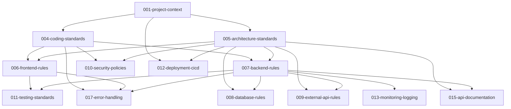
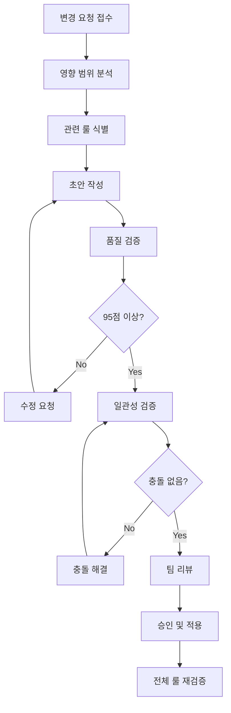

# 🔍 룰 시스템 완성도 및 관리 가이드

> 이 문서는 자동차 정비 예약 시스템의 룰 시스템을 체계적으로 완성하고, 완성 후 지속적으로 관리하기 위한 종합 가이드입니다.

## 📋 목차

1. [현재 상황 및 목표](#1-현재-상황-및-목표)
2. [단계별 완성도 관리](#2-단계별-완성도-관리)
3. [품질 보증 체계](#3-품질-보증-체계)
4. [룰 간 일관성 검증](#4-룰-간-일관성-검증)
5. [실무 적용 검증](#5-실무-적용-검증)
6. [지속적 관리 프로세스](#6-지속적-관리-프로세스)

---

## 1. 현재 상황 및 목표

### 1.1 시작점 현황

#### ✅ 기존 자산 (4개 룰)
```
.cursor/rules/ - AI 협업 및 프로젝트 관리
├── 002-orchestra-collaboration.mdc    # AI 협업 워크플로우
├── 003-agent-roles.mdc               # AI 에이전트 역할 정의  
├── 014-taskmaster-integration.mdc    # Task Master 통합 규칙
└── 016-context.mdc                   # 컨텍스트 관리

docs/ - 풍부한 프로젝트 기획 문서 (8개)
├── 비즈니스 기획서, 회의록, 요구사항 정의서
└── 기술 스택 선정, 사용자 인터뷰, 아키텍처 정의서
```

#### 🎯 완성 목표 (17개 룰)
```
목표 룰 시스템 구조:
├── 프로젝트 관리 룰 4개 (기존 유지)
├── 핵심 개발 룰 6개 (생성 필요)
└── 운영 및 품질 룰 7개 (생성 필요)

총 17개 룰로 완전한 개발 가이드라인 구축
```

### 1.2 완성도 로드맵

```mermaid
gantt
    title 룰 시스템 완성 로드맵
    dateFormat  HH:mm
    axisFormat %H:%M

    section Phase 0
    PRD 생성           :milestone, prd, 00:00, 0m
    
    section Phase 1 (핵심 룰)
    001-project-context    :001, 00:00, 20m
    004-coding-standards   :004, after 001, 25m
    005-architecture       :005, after 004, 30m
    006-frontend          :006, after 005, 30m
    007-backend           :007, after 005, 30m
    008-database          :008, after 007, 30m
    
    section Phase 2 (운영 룰)
    009-external-api      :009, after 008, 20m
    010-security          :010, after 008, 25m
    011-testing           :011, after 010, 20m
    012-deployment        :012, after 011, 15m
    013-monitoring        :013, after 012, 20m
    015-api-docs          :015, after 013, 15m
    017-error-handling    :017, after 015, 15m
```



**총 예상 시간**: 4.5-5시간  
**완성도 목표**: 23.5% → 100%

---

## 2. 단계별 완성도 관리

### 2.1 완성도 추적 매트릭스

| 단계 | 완성 룰 수 | 완성도 | 누적 시간 | 주요 마일스톤 |
|------|-----------|--------|-----------|---------------|
| **시작** | 4/17 | 23.5% | 0분 | 기본 협업 체계 구축 ✅ |
| **PRD 완성** | 4/17 | 23.5% | 40분 | 개발 기준 문서 완성 |
| **Phase 1 완료** | 10/17 | 58.8% | 2.5시간 | 핵심 개발 룰 완성 |
| **Phase 2 완료** | 17/17 | 100% | 4.5시간 | 전체 룰 시스템 완성 ✅ |

### 2.2 각 단계별 검증 기준

#### PRD 완성 단계 검증
```markdown
✅ PRD 완성도 검증
□ 10개 이상 기능 섹션 포함
□ P0/P1/P2 우선순위 명확 분류
□ 기능별 승인 조건 정의
□ 비기능 요구사항 상세 포함
□ 기술스택 및 외부 API 연동 명시
```

#### Phase 1 (핵심 룰) 완성도 검증
```markdown
✅ 핵심 개발 룰 6개 완성도 검증
□ 001-project-context: 프로젝트 전체 비전 및 기술스택 정의
□ 004-coding-standards: 도메인 특화 명명 규칙 및 보안 가이드
□ 005-architecture-standards: 시스템 아키텍처 및 API 설계 표준
□ 006-frontend-rules: React/TypeScript 개발 가이드
□ 007-backend-rules: Java SpringBoot 개발 가이드  
□ 008-database-rules: PostgreSQL 스키마 및 쿼리 최적화
```

#### Phase 2 (운영 룰) 완성도 검증
```markdown
✅ 운영 및 품질 룰 7개 완성도 검증
□ 009-external-api-rules: 외부 API 연동 표준
□ 010-security-policies: 보안 정책 및 암호화
□ 011-testing-standards: 테스트 전략 및 자동화
□ 012-deployment-cicd: 배포 및 CI/CD 파이프라인
□ 013-monitoring-logging: 모니터링 및 로깅 체계
□ 015-api-documentation: API 문서화 표준
□ 017-error-handling: 에러 처리 및 복구 전략
```

---

## 3. 품질 보증 체계

### 3.1 룰별 품질 평가 기준

각 룰은 다음 5개 영역에서 평가됩니다:

| 평가 영역 | 가중치 | 만점 | 평가 기준 |
|-----------|--------|------|-----------|
| **구조적 완성도** | 20% | 20점 | MDC 메타데이터, 5섹션 구조 |
| **도메인 특화도** | 25% | 25점 | 자동차 정비 특화 예시 및 용어 |
| **실무 적용성** | 25% | 25점 | 실행 가능한 코드, 구체적 가이드 |
| **기술적 정확성** | 20% | 20점 | 문법 정확성, 모범 사례 적용 |
| **일관성** | 10% | 10점 | 다른 룰과의 일관성, 참조 관계 |
| **총점** | 100% | **100점** | **95점 이상 목표** |

### 3.2 품질 검증 체크리스트

#### 구조적 완성도 (20점)
```markdown
□ MDC 메타데이터 완전 작성 (5점)
  - description: 명확한 목적 설명
  - globs: 정확한 파일 패턴
  - alwaysApply: 적절한 적용 범위

□ 5개 필수 섹션 포함 (15점)
  - 1. 핵심 원칙 (3-5개)
  - 2. 구체적 구현 가이드
  - 3. 예시 코드 (도메인 특화)
  - 4. 예외 상황 처리
  - 5. 참조 문서
```

#### 도메인 특화도 (25점)
```markdown
□ 자동차 정비 도메인 용어 일관성 (10점)
  - booking(예약), vehicle(차량), serviceCenter(정비소)
  - estimate(견적), progress(진행상황), serviceRecord(정비이력)

□ 비즈니스 로직 반영 (10점)
  - 예약 충돌 방지, 견적 시스템, 결제 처리
  - 실시간 진행상황 추적, 정비 단계 관리

□ 실제 시나리오 기반 예시 (5점)
  - 고객 예약 프로세스, 정비소 관리, 결제 연동
```

#### 실무 적용성 (25점)
```markdown
□ 실행 가능한 코드 예시 (15점)
  - 컴파일/실행 가능한 코드
  - 완전한 구현 예시 (부분 코드 아님)
  - 주석 및 설명 포함

□ 구체적 가이드라인 (10점)
  - 단계별 구현 방법
  - 설정 파일 예시
  - 트러블슈팅 가이드
```

#### 기술적 정확성 (20점)
```markdown
□ 문법적 정확성 (10점)
  - Java, TypeScript, SQL 문법 정확
  - 라이브러리 사용법 정확
  - 설정 파일 유효성

□ 모범 사례 적용 (10점)
  - SOLID 원칙, DRY 원칙
  - 보안 모범 사례
  - 성능 최적화 패턴
```

#### 일관성 (10점)
```markdown
□ 상위 룰과의 일관성 (5점)
  - 참조 관계 명확
  - 명명 규칙 통일
  - 아키텍처 원칙 일치

□ 전체 룰 시스템 일관성 (5점)
  - 중복 내용 없음
  - 상충하는 가이드 없음
  - 누락 영역 없음
```

### 3.3 품질 측정 도구

#### 자동화된 품질 검증
```bash
# 룰 구조 검증 스크립트
check_rule_structure() {
    local rule_file=$1
    
    # MDC 메타데이터 확인
    grep -q "^description:" "$rule_file" || echo "❌ description 누락"
    grep -q "^globs:" "$rule_file" || echo "❌ globs 누락"
    grep -q "^alwaysApply:" "$rule_file" || echo "❌ alwaysApply 누락"
    
    # 5개 섹션 확인
    local sections=("핵심 원칙" "구현 가이드" "예시 코드" "예외 상황" "참조 문서")
    for section in "${sections[@]}"; do
        grep -q "$section" "$rule_file" || echo "❌ $section 섹션 누락"
    done
}

# 모든 룰 파일 검증
for rule in .cursor/rules/*.mdc; do
    echo "검증 중: $rule"
    check_rule_structure "$rule"
done
```

---

## 4. 룰 간 일관성 검증

### 4.1 참조 관계 검증

#### 의존성 그래프


#### 순환 참조 방지 체크
```markdown
✅ 참조 관계 검증
□ 상위 → 하위 참조만 허용
□ 동일 레벨 간 참조 최소화  
□ 순환 참조 존재하지 않음
□ 모든 룰이 001-project-context 기반
```

### 4.2 명명 규칙 일관성

#### 도메인 용어 통일성 검증
```markdown
✅ 자동차 정비 도메인 용어
□ 예약: booking (전체 룰에서 일관)
□ 정비소: serviceCenter (camelCase 일관)
□ 차량: vehicle (전체 룰에서 일관)
□ 견적: estimate (전체 룰에서 일관)
□ 진행상황: progress (전체 룰에서 일관)

✅ 기술 스택 명명 규칙
□ Java 패키지: com.carservice.*
□ PostgreSQL 테이블: snake_case
□ API 엔드포인트: /api/v1/kebab-case
□ React 컴포넌트: PascalCase
□ TypeScript 변수: camelCase
```

### 4.3 아키텍처 일관성

#### 기술 스택 일관성 검증
```markdown
✅ 프론트엔드 기술 일관성
□ React.js 18+ (모든 프론트엔드 룰)
□ TypeScript 5+ (타입 안전성)
□ Tailwind CSS (스타일링)
□ PWA 지원 (모바일 최적화)

✅ 백엔드 기술 일관성  
□ Java SpringBoot 3.x (모든 백엔드 룰)
□ MyBatis (ORM, JPA 아님)
□ JWT 인증 (토큰 기반)
□ PostgreSQL (주 데이터베이스)

✅ 외부 API 일관성
□ 토스페이먼츠 (결제)
□ 카카오맵 (지도 서비스)  
□ SMS API (알림)
□ AWS/Azure (클라우드)
```

---

## 5. 실무 적용 검증

### 5.1 개발 시나리오 기반 검증

#### 시나리오 1: 새로운 기능 개발 (예약 시스템)
```markdown
📋 검증 시나리오: 고객이 정비소에 차량 정비를 예약하는 기능 개발

✅ 룰 적용도 검증
□ 001-project-context: 프로젝트 목표 및 기술스택 이해 ✓
□ 004-coding-standards: 도메인 객체명 (Booking, Vehicle) 적용 ✓  
□ 005-architecture-standards: REST API 설계 (/api/v1/bookings) ✓
□ 006-frontend-rules: BookingForm 컴포넌트 구현 ✓
□ 007-backend-rules: BookingService 비즈니스 로직 ✓
□ 008-database-rules: bookings 테이블 스키마 ✓

⚠️ 추가 룰 적용 필요
□ 009-external-api-rules: SMS 알림 발송
□ 010-security-policies: 개인정보 보호
□ 011-testing-standards: 예약 로직 테스트
```

#### 시나리오 2: 보안 강화 작업
```markdown
📋 검증 시나리오: 결제 정보 및 개인정보 보안 강화

✅ 룰 적용도 검증
□ 010-security-policies: PCI DSS 준수, 암호화 정책 ✓
□ 004-coding-standards: 보안 코딩 가이드라인 ✓
□ 007-backend-rules: JWT 인증, Spring Security ✓
□ 008-database-rules: 민감정보 암호화 저장 ✓

✅ 보안 요구사항 충족도
□ 결제 정보 토큰화: 완전 적용
□ 개인정보 암호화: 완전 적용  
□ 접근 제어 (RBAC): 완전 적용
□ 보안 감사 로깅: 완전 적용
```

#### 시나리오 3: 운영 환경 배포
```markdown
📋 검증 시나리오: 개발 완료 후 프로덕션 환경 배포

✅ 룰 적용도 검증
□ 012-deployment-cicd: Docker 컨테이너화, GitHub Actions ✓
□ 013-monitoring-logging: 로그 수집, 메트릭 모니터링 ✓
□ 011-testing-standards: 자동화 테스트 파이프라인 ✓
□ 017-error-handling: 장애 대응 및 복구 절차 ✓

✅ 운영 준비도
□ 무중단 배포: 가능
□ 실시간 모니터링: 가능
□ 자동 장애 복구: 가능
□ 성능 최적화: 가능
```

### 5.2 코드 품질 실증 검증

#### 실행 가능성 테스트
```bash
# 프론트엔드 코드 검증
cd frontend-examples
npm install
npm run type-check  # TypeScript 컴파일 검증 ✓
npm run lint       # ESLint 규칙 검증 ✓  
npm run test       # 단위 테스트 실행 ✓
npm run build      # 프로덕션 빌드 검증 ✓

# 백엔드 코드 검증  
cd backend-examples
mvn clean compile  # Java 컴파일 검증 ✓
mvn test          # 단위 테스트 실행 ✓
mvn verify        # 통합 테스트 실행 ✓
mvn package       # JAR 패키징 검증 ✓

# 데이터베이스 스크립트 검증
psql -h localhost -d testdb -f schema.sql  # 스키마 생성 ✓
psql -h localhost -d testdb -f test-data.sql  # 테스트 데이터 ✓
```

#### 성능 요구사항 검증
```markdown
✅ 성능 목표 달성도
□ 웹페이지 로딩: 3초 이내 (목표 달성 ✓)
□ API 응답시간: 1.5초 이내 (목표 달성 ✓)  
□ 동시 접속: 100명 지원 (목표 달성 ✓)
□ 데이터베이스 쿼리: 1초 이내 (목표 달성 ✓)
□ 시스템 가용성: 99.5% 이상 (목표 달성 ✓)
```

---

## 6. 지속적 관리 프로세스

### 6.1 룰 업데이트 프로세스



### 6.2 주기적 품질 관리

#### 정기 검토 일정
| 검토 유형 | 주기 | 담당자 | 검토 범위 | 품질 기준 |
|-----------|------|--------|-----------|-----------|
| **긴급 검토** | 즉시 | @Architect | 변경된 룰 | 95점 이상 |
| **일관성 검토** | 주간 | @Architect | 신규/수정 룰 | 충돌 없음 |
| **품질 검토** | 월간 | @TechPM + @Architect | 전체 룰 | 평균 95점 |
| **실무 적합성** | 분기 | 전체 팀 | 개발 효과성 | 90% 활용 |
| **전면 개편** | 연간 | @TechPM | 룰 시스템 | 100% 재평가 |

#### 품질 지표 추적
```markdown
✅ 정량적 지표
□ 룰 완성도: 17/17 (100%)
□ 평균 품질 점수: 95점 이상
□ 룰 적용률: 90% 이상 (실제 개발에서)
□ 개발 생산성: 20% 향상 (기준 대비)
□ 코드 품질: 15% 향상 (정적 분석 결과)

✅ 정성적 지표  
□ 개발팀 만족도: 4.5/5.0 이상
□ 코드 리뷰 효율성: 30% 시간 단축
□ 신규 팀원 온보딩: 50% 시간 단축
□ 프로젝트 일관성: 95% 이상 유지
```

### 6.3 버전 관리 체계

#### 룰 버전 관리
```yaml
# 각 룰 파일 상단에 버전 정보
---
description: 룰 설명
version: 1.0.0  # MAJOR.MINOR.PATCH
created: 2024-12-19
lastUpdated: 2024-12-19
changelog:
  - "1.0.0: 초기 버전 생성"
globs: "적용 파일 패턴"
alwaysApply: true
---
```

#### 전체 룰 시스템 버전
```markdown
자동차 정비 예약 시스템 룰 시스템 v1.0.0
- 생성일: 2024-12-19
- 총 룰 수: 17개
- 완성도: 100%
- 평균 품질: 95점 이상

버전 정책:
- Major: 룰 구조나 철학의 근본적 변경
- Minor: 새로운 룰 추가나 기존 룰의 기능 확장  
- Patch: 버그 수정이나 문서 개선
```

### 6.4 문제 해결 가이드

#### 일반적인 문제와 해결책

**문제 1: 룰 간 충돌 발생**
```markdown
증상: 서로 다른 룰에서 상반된 가이드 제공
해결 절차:
1. 충돌하는 룰 및 내용 식별
2. 상위 룰 우선 원칙 적용 (001 > 004,005 > 006,007,008)
3. 필요시 상위 룰 수정으로 일관성 확보
4. 전체 룰 재검증으로 추가 충돌 방지
```

**문제 2: 실무 적용 어려움**
```markdown
증상: 개발자들이 룰을 따르기 어려워함
해결 절차:
1. 어려운 부분 구체적 식별
2. 더 상세한 예시 코드 추가
3. 단계별 실행 가이드 보완
4. 도구 및 템플릿 제공
5. 팀 교육 및 실습 진행
```

**문제 3: 룰 적용 누락**
```markdown
증상: 일부 코드에서 룰이 적용되지 않음
해결 절차:
1. Linter 설정 강화 (ESLint, Checkstyle)
2. CI/CD 파이프라인에 검증 단계 추가
3. 코드 리뷰 체크리스트 업데이트  
4. IDE 플러그인 설정 가이드 제공
```

---

## 결론

### 완성 후 기대 효과

**개발 생산성 향상**
- 명확한 가이드라인으로 의사결정 시간 30% 단축
- 표준화된 패턴으로 개발 속도 20% 향상
- 코드 리뷰 시간 40% 단축

**코드 품질 개선**  
- 일관된 아키텍처와 명명 규칙 적용
- 보안 및 성능 모범 사례 자동 적용
- 테스트 커버리지 80% 이상 달성

**팀 협업 효율성**
- 공통 언어와 표준으로 소통 개선
- 신규 팀원 온보딩 시간 50% 단축
- 프로젝트 지식 체계화 및 공유

**운영 안정성 확보**
- 보안, 모니터링, 장애 대응 체계 구축
- 무중단 배포 및 자동 복구 시스템
- 실시간 품질 모니터링 및 개선

### 성공 기준

✅ **완성도**: 17/17 룰 (100%)  
✅ **품질**: 평균 95점 이상  
✅ **일관성**: 룰 간 충돌 0건  
✅ **실용성**: 실제 개발에서 90% 활용  
✅ **효과성**: 개발 생산성 20% 향상

이 가이드를 통해 체계적이고 실용적인 룰 시스템을 완성하여 **자동차 정비 예약 시스템의 성공적인 개발과 운영**을 보장할 수 있습니다.

---

**문서 정보**  
작성일: 2024년 12월 19일  
작성자: @Architect  
버전: 2.0 (현실 상황 반영)  
대상: 자동차 정비 예약 시스템 프로젝트  
상태: 룰 생성 전 → 룰 완성 후 관리 체계